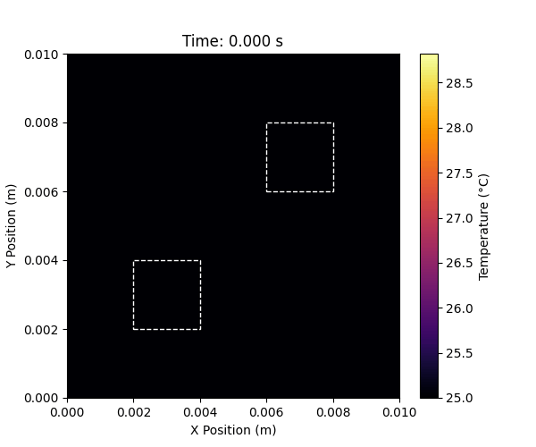

# Computational Engineering: Thermodynamics & Chemical Systems

## Objective
A collection of numerical models and simulations developed to solve complex ordinary and partial differential equations (ODEs/PDEs) governing mechanical and chemical engineering systems. 

This repository stems from coursework in Computational Engineering (BVL) and demonstrates proficiency in translating physical laws (mass balance, heat transfer, chemical kinetics) into robust Python simulations using scientific computing libraries.

## Technical Stack
* **Language:** Python
* **Libraries:** NumPy, SciPy, Matplotlib

## Core Simulation Modules

### 1. 2D Thermal Modeling (PDEs)
* **Files:** `PDE_Thermal_Model.py`, `2D_Heat_Map_Evolution.gif`
* **Description:** Solves the 2D heat equation using the Method of Lines to simulate the thermal behavior and heat dissipation of a multi-core processor. 
* **Output:** 

### 2. Continuous Stirred-Tank Reactor - CSTR (ODEs)
* **Files:** `Continuous Stirred Tank Reactor (CSTR).py`, `CSTR_Plots.png`, `CSTR_conversion.png`
* **Description:** Models the transient behavior of a CSTR. Solves coupled ordinary differential equations to track reactant concentration and conversion rates over time.

### 3. Multi-Component Distillation Column
* **Files:** `Binary_Distillation_column_Model.py`, `DC_modelling_winner.py`, `Distillation_Column_Plots.png`
* **Description:** Simulates the steady-state temperature and composition profiles across the stages of a distillation column using rigorous mass and energy balance matrices.

## Context for Research
Building these deterministic numerical models provided the mathematical foundation necessary for my current transition into Scientific Machine Learning and Physics-Informed Neural Networks (PINNs). Understanding how traditional solvers (like SciPy) handle physical constraints is critical for embedding those same constraints into AI loss functions.
